# nocap 🧢

**Your coding agent said "done". nocap checks the receipts.**

[](https://github.com/brad-k-dev/nocap/actions/workflows/test.yml)   

[English](#english) · [한국어](#한국어)

<p align="center"></p>

---

## English

nocap is a **Stop hook** for Claude Code and Codex. When your agent finishes a turn claiming
*"tests pass"*, *"the build succeeds"* or *"it's fixed"*, nocap looks through the
session for the receipt: a command that actually ran **after the last code edit** and
actually succeeded. No receipt → the agent isn't allowed to stop until it runs the check
or takes the claim back.

### What it catches

| The agent says | nocap wants to see, after the last code edit |
|---|---|
| "All tests pass" / "테스트 40개 통과" | a test command (`pytest`, `npm test`, `vitest`, `cargo test`, `xcodebuild test`, …) that succeeded |
| "The build succeeds" / "빌드 성공" | a build command (`tsc`, `npm run build`, `cargo build`, `xcodebuild`, `swiftc`, …) that succeeded |
| "It's fixed" / "해결했습니다" | anything that exercised the code and succeeded |

It is harder to fool than an exit code:
- `pytest | tail` exits 0 even when tests fail; nocap reads the output (`2 failed`, `** BUILD FAILED **`).
- Edited code after the last test run? The old green run no longer counts.
- Edits made through Bash (`sed -i`, `python3 - <<EOF … open(p,'w')`) count as edits.
- Background runs count once their task notification says they finished cleanly.
- Editing docs, notes or files outside the project doesn't make a passing run stale.
- "I haven't run the tests", quoted text and code blocks are not claims.

### Numbers from real sessions

I replayed **2,512 turns** of my own Claude Code and Codex history through nocap and
checked every block by hand:

| | turns | blocked | real | false alarms |
|---|---|---|---|---|
| Claude Code | 957 | 11 | 10 | 1 (unclear, counted as false) |
| Codex | 1,555 | 4 | 4 | 0 |
| **total** | **2,512** | **15** | **14 (93%)** | **1** |

Nearly every real catch has the same shape: the agent ran the tests, **then edited the code
again**, rebuilt (or did nothing), and still reported "N tests pass".

Run it on your own history — nothing leaves your machine:

```bash
python3 replay.py            # replays ~/.claude/projects and ~/.codex/sessions
```

### Install

```
/plugin marketplace add brad-k-dev/nocap
/plugin install nocap@nocap
```

Needs `python3` (3.9+) on your PATH. No dependencies, no API key, no network.

### Codex

Verified live with Codex CLI **0.157** (0.133 never calls Stop hooks): Codex claimed
"All tests pass", nocap blocked it, Codex ran `python3 -m pytest` and showed `1 passed`.
nocap reads every Codex log shape seen in the wild: `CommandExecution` items,
`exec_command`/`write_stdin`/`apply_patch` calls, and code-mode cells.

```bash
git clone https://github.com/brad-k-dev/nocap ~/.nocap-src
```

`~/.codex/hooks.json`:

```json
{"hooks": {"Stop": [{"hooks": [{"type": "command", "command": "python3 ~/.nocap-src/hooks/nocap.py", "timeout": 60}]}]}}
```

and `hooks = true` under `[features]` in `~/.codex/config.toml` (Codex CLI 0.157+).

### Experimental: Laya backend

`NOCAP_LAYA=1` hands claim detection to [Laya](https://github.com/NandhaKishorM/laya),
the open System-1 decision model (Python 3.10+, `pip install laya`, then point
`NOCAP_PYTHON` at that interpreter). Measured zero-shot, it spots *whether* a message
claims success well, but often gets the *kind* of claim wrong ("All tests pass" →
tests + build + fixed), which would raise false alarms. So it is off by default; a
fine-tuned checkpoint is on the roadmap.

### Limits

- nocap knows tests ran from the command (`pytest`, `npm test`, `npm run check`, …) or
  from the output (`12 passed`, `# pass 8`). A custom script that prints neither isn't seen.
- Claims about manual QA, other PRs, or earlier work are skipped, not checked.
- After one block the agent may stop on its next try (`stop_hook_active`), so nocap
  can never trap it in a loop.

### Develop

```bash
python3 test_nocap.py   # prints "ok"
```

---

## 한국어

nocap은 Claude Code와 Codex의 **Stop 훅**입니다. 에이전트가 *"테스트 통과"*, *"빌드 성공"*,
*"해결했습니다"* 라고 말하며 턴을 끝내려 하면, nocap이 세션 기록에서 **영수증**을 찾습니다.
영수증은 **마지막 코드 수정 이후에** 실제로 실행되어 실제로 성공한 명령입니다. 영수증이 없으면
에이전트는 검증을 실행하거나 주장을 철회하기 전까지 멈출 수 없습니다.

### 잡아내는 것

| 에이전트의 말 | 마지막 코드 수정 이후 필요한 것 |
|---|---|
| "테스트 40개 통과" / "All tests pass" | 성공한 테스트 명령 (`pytest`, `npm test`, `vitest`, `cargo test`, `xcodebuild test` 등) |
| "빌드 성공" / "The build succeeds" | 성공한 빌드 명령 (`tsc`, `npm run build`, `cargo build`, `xcodebuild`, `swiftc` 등) |
| "해결했습니다" / "It's fixed" | 코드를 실제로 실행해 본 성공한 명령 |

종료 코드보다 속이기 어렵습니다.
- `pytest | tail` 은 테스트가 실패해도 종료 코드가 0입니다. nocap은 출력(`2 failed`, `** BUILD FAILED **`)을 읽습니다.
- 마지막 테스트 이후 코드를 고쳤다면 예전의 통과 기록은 무효입니다.
- Bash로 한 수정(`sed -i`, `python3 - <<EOF … open(p,'w')`)도 수정으로 칩니다.
- 백그라운드 실행은 완료 알림이 정상 종료를 알릴 때만 인정합니다.
- 문서·메모·프로젝트 밖 파일 수정은 통과 기록을 무효로 만들지 않습니다.
- "테스트는 아직 실행하지 않았습니다", 따옴표 속 문장, 코드 블록은 주장이 아닙니다.

### 실제 세션 수치

제 Claude Code와 Codex 기록 **2,512턴**을 nocap에 재생하고, 차단된 건을 모두 직접 확인했습니다.

| | 턴 | 차단 | 진짜 | 오탐 |
|---|---|---|---|---|
| Claude Code | 957 | 11 | 10 | 1 (불확실, 오탐으로 계산) |
| Codex | 1,555 | 4 | 4 | 0 |
| **합계** | **2,512** | **15** | **14 (93%)** | **1** |

진짜로 잡은 건은 거의 같은 모양입니다. 테스트를 돌린 **뒤에 코드를 또 고치고**, 빌드만 하거나
아무것도 안 한 채 "테스트 N개 통과"라고 보고했습니다.

내 기록으로 직접 돌려보세요. 외부로 아무것도 나가지 않습니다.

```bash
python3 replay.py            # ~/.claude/projects 와 ~/.codex/sessions 를 재생
```

### 설치

```
/plugin marketplace add brad-k-dev/nocap
/plugin install nocap@nocap
```

PATH에 `python3`(3.9+)만 있으면 됩니다. 의존성, API 키, 네트워크 모두 필요 없습니다.

### Codex

Codex CLI **0.157**에서 실제로 확인했습니다 (0.133은 Stop 훅을 호출하지 않습니다). Codex가
"All tests pass"라고 하자 nocap이 막았고, Codex가 `python3 -m pytest`를 실행해 `1 passed`를 보여줬습니다.
nocap은 실제로 확인된 모든 Codex 로그 형식을 읽습니다: `CommandExecution` 항목,
`exec_command`/`write_stdin`/`apply_patch` 호출, 코드 모드 셀.

```bash
git clone https://github.com/brad-k-dev/nocap ~/.nocap-src
```

`~/.codex/hooks.json`:

```json
{"hooks": {"Stop": [{"hooks": [{"type": "command", "command": "python3 ~/.nocap-src/hooks/nocap.py", "timeout": 60}]}]}}
```

그리고 `~/.codex/config.toml` 의 `[features]` 에 `hooks = true` (Codex CLI 0.157 이상).

### 실험 기능: Laya 백엔드

`NOCAP_LAYA=1` 이면 주장 탐지를 오픈 System-1 결정 모델 [Laya](https://github.com/NandhaKishorM/laya)에
맡깁니다 (Python 3.10+, `pip install laya` 후 `NOCAP_PYTHON` 을 그 인터프리터로 지정).
제로샷으로 측정해 보니 메시지가 성공을 주장하는*지*는 잘 잡지만 주장의 *종류*를 자주 틀립니다
("All tests pass" → 테스트 + 빌드 + 해결). 오탐이 늘어나므로 기본값은 꺼짐이며,
파인튜닝 체크포인트는 로드맵에 있습니다.

### 한계

- nocap은 명령(`pytest`, `npm test`, `npm run check` 등)이나 출력(`12 passed`, `# pass 8`)으로
  테스트 실행을 알아봅니다. 둘 다 없는 커스텀 스크립트는 보이지 않습니다.
- 수동 QA, 다른 PR, 이전 작업에 대한 주장은 검사하지 않고 넘어갑니다.
- 한 번 차단된 뒤 다음 종료 시도는 통과시킵니다(`stop_hook_active`). 에이전트를 무한 루프에 가두지 않습니다.

### 개발

```bash
python3 test_nocap.py   # "ok" 출력
```

## License

MIT
